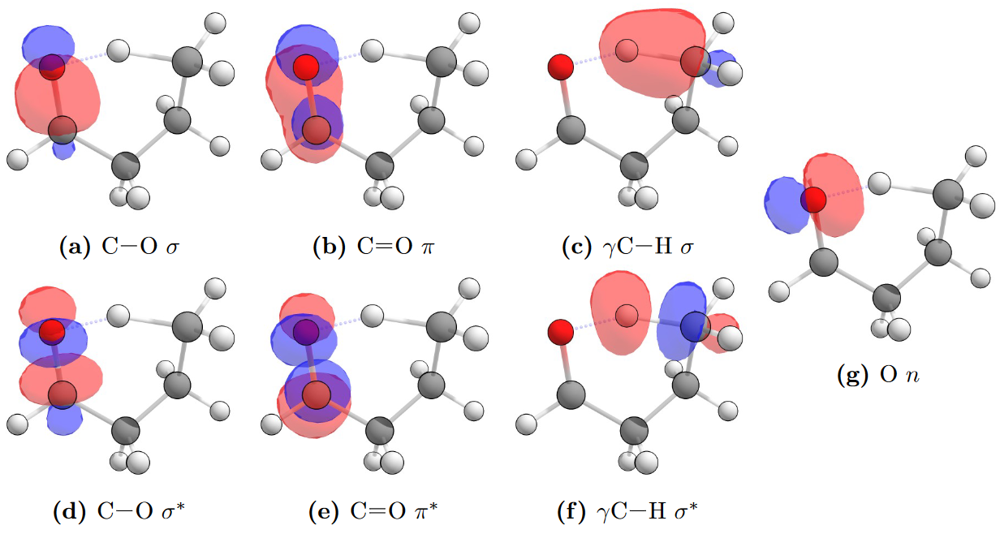

*This post is adapted straight from my* [PhD Thesis](http://handle.unsw.edu.au/1959.4/65036)*, and deals with struggle of creating a workable active space for multiconfigurational calculations.* 

Multiconfigurational methods are where the training wheels come off, you can no longer use a "black-box" combination of method and basis set -- you **have** to think about the chemical problem. There is therefore no right answer, but chemical intuition comes into play (what bonds break/form, which orbitals are populated?). Start with simple orbitals and build up. So, small basis sets, make sure it converges, then enlarge the basis set if needs must. Try to treat the "which orbitals?" and "how small a basis set can I get away with?" problems separately. I've also been told that calculating the cation (thus giving you "pulled in" orbitals) is another trick to get started.
---

## Complete Active Space (CASSCF) calculations and Minimum Energy Conical Intersection (MECI) searches

In order to search for an optimised minimum energy conical intersection (MECI), a configuration where two electronic states are degenerate in energy, a multiconfigurational quantum chemistry method must be used. This involves optimising both the orbital coefficients, but unlike single-reference methods, also optimising the combinations of multiple Slater determinants; also known as configuration state functions (CSFs) in the language of multiconfigurational methods. The choice of an appropriate set of CSFs is crucial for a qualitatively correct description of the wavefunction.

While individual CSFs could be manually selected, one of the most common approaches is the complete active space (CAS) method where all possible configurations inside a selected orbital active space are treated. The self-consistent field (SCF) is used, and so the method at at this level of theory is known as CASSCF. The use of an active space removes the burden of choosing particular CSFs to include in the SCF optimisation, but requires the selection of appropriate active space orbitals which capture the chemical process of interest. Usually this includes any orbitals near the frontier orbitals, those involved in making and breaking bonds, the inclusion of correlated bonding and anti-bonding pairs, and any orbitals which are calculated to have incomplete occupation according to orbital population schemes.

### Generation of Natural Bond Orbitals
Selection of orbitals to include in the active space is more easily done if natural bond orbitals (NBOs) are used since they correspond to chemical intuition and are localised to the reactive space, while canonical orbitals are often too delocalised to be interpretable.

Minimal basis sets are easier to converge in a CASSCF calculation than large basis sets, and also aid in intrepretability. The starting point for all calculations was generation of an initial orbital population at the $$S_1$$ TS configuration, using NBOs at the HF/STO-3G level of theory. An example Gaussian input file to generate these NBOs is given below. This process was also repeated if a large basis set, such as 6-31+G(d), was used.

`
%chk=[file_path]/save_NBOs.chk`
`# HF/STO-3G Pop=(Full,SaveNBOs)`
`
Title Card Required

0 1
[Molecule input]
`

The generated NBOs can also be examined in an external program (Chemcraft in this example). The Gaussian input file below shows the extra input at the bottom required to call on the NBO program to print the calculated natural bond orbitals to file.  These will be labelled FILE.$$X$$ where $$X$$ is 31--37. Chemcraft can open up FILE.31 directly, and should recognise the FILE.$$X$$ files for import. Chemcraft can then render NBOs from these files using the drop-down options: `Tools $$\rightarrow$$ Orbitals $$\rightarrow$$ Render molecular orbitals $$\rightarrow$$ NBOs`. Be aware: there is a reordering from the .log file and the .chk file, so only rely on the numbering in GaussView when identifying orbital indexes.

`
%chk=[file_path]/print_NBOs.chk`
`#P HF/STO-3G Pop=(Full,NBORead,SaveNBO) gfoldprint`
`
Title Card Required

0 1
[Molecule input]

$NBO BNDIDX PLOT $END
`

### Selection of the active space
It is useful to check both the character of these NBOs from their density distribution, as well as their occupation value according to the NBO scheme. Any molecular orbitals which have occupations that differ significantly from the 0/2 value for virtual/occupied orbitals are likely candidates for inclusion in the active space.

The conical intersection of interest is between the $$S_1$$/$$S_0$$ states of the carbonyl. This conical intersection will be present near the vicinity of the transition state which involves a 1,5--H-shift from the carbonyl oxygen to the $$\gamma$$-hydrogen. Correlated pairs of bonding and anti-bonding orbitals should be included, for example if a C-H $$\sigma$$ bonding orbital is included the corresponding C-H $$\sigma^{*}$$ antibonding orbital should also be included. The oxygen $$n$$ orbital which interacts with the $$\gamma$$-hydrogen and also changes occupation in the excited state is crucial to include in active space, as well as the C=O $$\pi$$ bonding and antibonding orbitals.

Additionally, since the photoexcited C=O moiety abstracts a hydrogen atom to form a C-O-H bond, the C-O orbitals were found to be important for inclusion in the active space. This is particularly true when a STO-3G minimal basis set was used, which would deliver optimised C-O bond lengths approximately 0.3 Å larger than in the transition state structure. With large basis sets the C-O bond length varied little from the transition state structure and hence the inclusion of corresponding orbitals was of less importance.

A reasonable (8,7) active space for typical saturated carbonyls includes:
    - C-O $$\sigma$$ and $$\sigma^{*}$$ orbitals.
    - C=O $$\pi$$ and $$\pi^{*}$$ orbitals.
    - O $$n$$ orbital of the lone pair.
    - $$\gamma$$C-H $$\sigma$$ and $$\sigma^{*}$$ orbital.

The NBOs which correspond to this active space are shown in the example of butanal below at an isosuraface value of 0.1. While literature calculations use a (8,7) active space, Kletskii *et al.* [Competing Mechanisms of Norrish and Norrish-Like Reactions in a Wide Range of Systems — from Carbonyl Compounds to Nitrogen Oxide Donators](http://dx.doi.org/10.1016/j.comptc.2014.08.025), a (10,8) active space that includes the alternate O $$n$$ oxygen-centred NBO was used as the largest active space. Structures computed from such CAS(10,8) calculations are reported in the main body of the thesis. 

Natural bond orbitals for butanal, showing those typical for the active space of a CAS(8,7) calculation on a saturated carbonyl. CAS(10,8) active spaces include the other oxygen-centred NBO.
{:.figcaption}

For unsaturated species, it was found to be beneficial to also include the $$\pi$$ and $$\pi^{*}$$ orbitals of the point of unsaturation. A (12,10) active space is very computationally demanding, so for unsaturated species the (10,8) active space sized is preserved by removing the C-O $$\sigma$$ and $$\sigma^{*}$$ NBOs, and replacing them with the $$\pi$$ and $$\pi^{*}$$ orbitals from the point of unsaturation, as illustrated below. 

Natural bond orbitals for 2-oxobutanal, showing those typical for the active space of a CAS(10,8) calculation on an unsaturated carbonyl. In these carbonyls with a point of unsaturation the other π and π∗ NBOs are included in favour of the C-O σ and σ∗ NBOs to keep the active space manageable.
{:.figcaption}

Once identified, these orbitals of interest need to be rotated into the active space. The orbitals which are considered in the active space are those nearest the HOMO/LUMO frontier according to the ($$n$$,$$m$$) active space chosen. The ($$n$$,$$m$$) nomenclature means enough occupied molecular orbitals to host $$n$$ electrons are treated as active. These are taken from the HOMO index and those sequentially below. The number of virtual orbitals in the active space is $$m$$ less the number of active occupied orbitals, and they are indexed from the LUMO and those sequentially above it.

### Performing CASSCF and MECI calculations
The easiest way to perform this active space selection with the orbitals in the correct index is to interchange orbitals read in from the NBO checkpoint file. This process is illustrated in the example Gaussian input file below --- interchanging as an example orbitals 9 and 25, as well as 40 and 31. 

Note: before running the input file below, copy the checkpoint file containing the saved NBOs to have same name as the checkpoint filename used here, so the CASSCF calculation can read in the correct NBOs. The molecular geometry does not need to be supplied since it is read from the checkpoint file.

The `iop(5/7=$$N$$)` keyword sets the amount of CASSCF convergence cycles used. While this can be increased, a slow or difficult to converge CASSCF calculation is often indicative of a poor active space. In some large molecules convergence can be slow, but if the energy is seen to be monotonically decreasing with each cycle then simply increasing the amount of available cycles may be all that is needed. 

`
%chk=[file_path]/[molecule]_S0_8-7.chk`
`# CASSCF(8,7)/STO-3G iop(5/7=200) Guess=(Read,Alter) Geom=Checkpoint` 
`
Title Card Required

0 1

9,25
40,31
`

If this CAS($$n$$,$$m$$) calculation converges on the $$S_0$$ state at configuration of the $$S_1$$ NTII TS geometry calculated by TD-DFT, then this  wavefunction is taken as a good initial guess for a beginning a conical intersection optimisation.

An example input file of running a minimum energy conical intersection (MECI) search with Gaussian is given below. Again, the checkpoint file from a previous job must be copied to this checkpoint filename specified in the current job to read the orbitals, in this case from the converged CAS $$S_0$$ calculations. Note: in Gaussian 16 the state average weights must be included at the bottom of the input file, whereas Gaussian 09 does not need this extra input and defaults to the 0.5, 0.5 weighting between the upper and lower state of the same spin.

`
%chk=[file_path]/[molecule]_CI_search.chk`
`# CASSCF(8,7)/STO-3G iop(1/8=5) Guess=Read Geom=Checkpoint Opt=Conical`  
`
Title Card Required

0 1

0.5 0.5
`

The `iop(1/8=$$N$$)` keyword sets the maximum step size during the optimisation, and  generally needs to be decreased from its default value of $$N = 30$$ which corresponds to 0.3 Bohr. Since the $$S_1$$ Norrish Type II TS structure is taken as being close MECI a small step size is appropriate and avoids issues where the optimiser can overshoot the MECI several times if large step sizes are used. The maximum number of convergence cycles may again need to be increased through the use of the `iop(5/7=$$N$$)` keyword, however since an already converged $$S_0$$ CAS wavefunction is used as the initial guess the convergence during MECI searches tended to be well behaved, and convergence issues were often an indication that the geometry optimiser has strayed into a bad part of configuration space and a new guess geometry must be used. 

The $$S_1$$/$$S_0$$ state energy difference is reported in the log file as `\Energy difference=     $$X$$`' and this difference should be monitored, as well as the usual geometry convergence criteria of force and displacement values. If the energy difference, forces, or geometry begin to oscillate around a central zero value then decreasing the step size at this stage may improve the MECI search.
