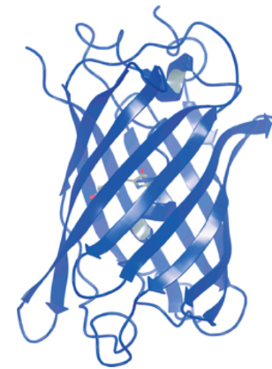

*This post is adapted from* [a talk](https://github.com/keiran-rowell/Presentations/blob/main/Bioluminesce%20-%20theory%20group%20presentation.pdf) *I gave at one of the University of Sydney's Theory Group meetings, but is ulimately a refashioned book report of* [Bioluminescene by Thérèse Wilson & J. Woodland Hastings](https://www.hup.harvard.edu/catalog.php?isbn=9780674067165). *The Theory Group talks were an fascinating intiative, where other theoretical chemists were able to present on any topics in science that interested them. I hope my talk was interesting, but I don't think anything could top the talk given by some postdocs on the optimal physical chemistry for cooking pasta and making espresso.*  

---

### Glow worms, fireflies, and glowsticks 

Glow worms, beyond inspiring a [calming ballad by Vashti Bunyan](https://youtu.be/WcZMzH04OwU), are bewitching organisms, especially if you are lucky enough to be in the Southern Hemisphere and see them up close in the [Waitomo Caves](https://www.waitomo.com/) or the [Blue Mountains](http://www.glowwormtours.sydney/Promo.aspx). Glow worms are the larvae of gnats, and glow to attract insects to their sticky thread, entrap them, and digest them. When desparate or territorial they will resort to cannibalism. The larvae metamorphose into adults that have no mouth, live for 2-6 days, mate, then die. Hardly seems worth it. Nevertheless they put on a spectacular show, and carry the Māori name titiwai meaning 'lights reflected in water'.

The North Americans get fireflies, which are associated with a [popular hit](https://youtu.be/psuRGfAaju4), and encompass a far broader church of glowing beetles. Adult fireflies have mouths. Beyond that I can't comment, I'm not a biologist. But fireflies [have captivated people throughout history](https://en.wikipedia.org/wiki/Firefly#In_culture).

Below is a rough chemical overview of where the magic 'glow' comes from: ultimately it is the energy released by breaking a strained O-O bond that affords the generation of an (triplet) electronically excited molecule, which proceeds to emit light when the electrons relax to the ground state. There are some [full-on physical chemistry behind this process](https://doi.org/10.1021/acs.chemrev.7b00649). 

In glowsticks a simple [dioxetane](https://en.wikipedia.org/wiki/1,2-Dioxetane) is used, energy is released when the glowstick is cracked, and a dye is electronically excited and begins glowing. If the dioextane is used by itself, an electronically excited carbonyl is created, but triplet carbonyls are [poor photon emitters](https://doi.org/10.1016/0009-2614(85)85149-6) -- so instead nature devises a concurrent charge-transfer process, creating a singlet excited state and ensuring a photon is emitted from the O-O bond breakage. A chemical schematic of the process looks like [this](../images/cyclic_peroxide_to_light).  

---

### Bioluminescence as oxygen disposal

Bioluminescence is found in creatures from sea to sky, but is not evenly distributed amongst organisms on the phylogenetic tree. The central argument in "Bioluminescence: living lights, lights for living" is that bioluminescence was actually an evolutionary accident; a side reactionfor disposing toxic oxyge,  back when oxygen was plentiful in Earth's atmosphere and single-celled organism had not yet adapted the chemistry to cope. This "oxygen detoxification" cause for bioluminescence is a compelling argument, but I don't believe it is proven conclusively. Regardless, here's a summary of the molecules used to create bioluminesence in different organisms

### Luciferin + luciferase = 💡  

The reactions that cause bioluminesence involve: a [luciferin](https://en.wikipedia.org/wiki/Luciferin) ('light-bearer'), a molecule that is electronically excited upon addition of O2; and a [luciferase](https://pdb101.rcsb.org/motm/78), a protein that catalyses the addition of O2 to luciferin, and alters the colour of the emitted photon based on the amino acids surrounding the luciferin. 

Every class of organism seems to have independently evolved a different luciferin and luciferase, lending credence that it was an oxygen disposal mechanism. Here are the different luciferins used by different organisms.  

### Crustaceans

Crustaceans use the simplest known bioluminescence process: they release two secretions, one containing the luciferin and the other contains the luciferase. The glow begins (see below) when the secretions come into contact.

The bioluminescence of the *Varigula hilgendorfii* crustacean.
{:.figcaption}

The luciferin is composed mainly of three amino acids and a central imidazopyrazinone, whose N-C=O bond breaks, releasing CO2 and light.

The luciferin of the *Varigula hilgendorfii* crustacean. The imidazolepyrazinone (highlighted in red) reacts with oxygen, generating an excited state similar to the excited state carbonyl in dioxetanes that was outlined above. 
{:.figcaption}

### Jellyfish

Sea creatures use many different luciferins, and the luciferin for the sea pansy is shown below, it is again is based on three amino acids and a central imidazolepyrazinone. 

The luciferin of the *Renilla reniformis* sea pansy closely resembles that for *Varigula* shown above, but is surrounded with different amino acids. 
{:.figcaption}

However, the bioluminescence of in the sea is that of jellyfish. Jellyfish bioluminesence is also the most widely used in the lab, supplying the ubiquitous [Green Fluorescent Protein (GFP)](https://en.wikipedia.org/wiki/Green_fluorescent_protein). GFP is used in countless assay and biological experiments -- it's easier to image tissue if it glows. 

In jellyfish, the luciferin is covalently bound to the luciferase, surrounded by a beta barrel structure (see below) which admits only water and provides control of the colour of bioluminesence.

The Green Fluorescent Protein in *Aequora victorua*, where an enveloping beta barrel is clearly seen around the luciferin. The amino acids in the barrel both prevent the luciferin reacting with external substances, and alter the colour of the light emitted (otherwise the luciferin would glow blue). 
{:.figcaption}

### Algae

Several algea can also bioluminesce, leading to the [beautiful appearance of sea sparkles](https://youtu.be/iD_6d2yN3g0) in certain shorelines of the world.

Here, a new type of luciferin is found a where modified [porphyrin](https://en.wikipedia.org/wiki/Porphyrin)-like molecule is used. The chemistry here is slightly different, adding oxygen to a [cyclopentanone](https://en.wikipedia.org/wiki/Cyclopentanone) group and yielding H2O, but light is generated just the same.

 

The luciferin of *Lingulodinium polyedrum* dinoflagellate algae species. 
{:.figcaption}

The bioluminesence of these algae only activate at night, but glow brightly (see below).

Glowing *Lingulodinium polyedrum* dinoflagellate algae, where the light-emitting organelles (scintillons) can be clearly seen. 
{:.figcaption}

### Fireflies

The glow of the lantern on a firefly's bum is a well known sight, and looks stunning en masse.

The impressive light organ located on abdomen of *Phonuris pyralis*.
{:.figcaption}

The chemisty of firefly luciferin is again different (see blow). 
 

The chemistry of firefly luciferin is driven by ATP (the 'battery molecule' of biology). Ultimately a dioxetane is again formed, and breaking the O-O bond yields an electronically excited carbonyl that emits light.   
{:.figcaption}

### Quantum chemical calculations on firefly luciferin 

In the 20th century several biological and chemical experiments gave us an understanding of photobiology. In the 21st century, new methods in computational chemistry and increases in compute power allows us to look into the physical chemistry behind the generation of an excited state luciferin through O-O bond breakage, and subsequent photon emission.
 
These calculations can get *very* complicated, so much so that people like [Isabelle Navizet](https://pagespro.univ-gustave-eiffel.fr/isabelle-navizet) and [Roland Lindh](https://www.katalog.uu.se/profile/?id=N10-584) have made careers out of this problem. 

Some diagrams follow for the theoretical chemists amongst us. For those without training: suffice to say the character of several excited states are involved, the presenence of an anionic group on the luciferin is required to generate a photon-emitting singlet excited state; and curiously a [conical intersection](https://doi.org/10.1146/annurev-physchem-032210-103522) exists along the reaction co-ordinate that ejects the CO2. The conical intersection was, at least to me, unexpected because it should *lower* the quantum yield of the luciferin since the conical intersection allows relaxation to the electronic ground state without emitting a photon. A very good review of bioluminescence using the insights gleaned from computational chemistry is provided in [The Chemistry of Bioluminescence: An Analysis of Chemical Functionalities](https://doi.org/10.1002/cphc.201100504).

Density Functional Theory calcuations indicate that the luciferin is in a (π,σ∗) ground state, and the anionic C-O- is crucial as the excess electronic undergoes a electronc transfer process to the site of the broken O-O bond to generate a singlet excited state $$S_1$$ upon ejection of the CO2.
{:.figcaption}

[Multiconfigurational quantum chemistry calculations]() show that the first singlet excited state $$S_1$$ is a (π,π^∗^) excitation, and transition state (TS) ejection of the CO2 corresponds to a very small energy gap between the $$S_1$$ and $$S_0$$ electronic states.
{:.figcaption}

The transition state (TS) ejecting the CO2 is generated by an [avoided crossing](https://doi.org/10.1351/pac197541040455) between the (π,σ^∗^) ground and excited states. As the CO2 seperates from teh luciferin, the luciferin can either proceed only to a (π,π^∗^) and eventually emit a photon to relax back down to the ground state, or follow the seam of a sloped conical intersection to access a closed-shell singlet product. 
{:.figcaption}

### QM/MM calculations on Luciferin

Finally, a hybrid QM/MM simulation can be used, where the luciferin is treated with a quantum mechanical method to capture the electronic excitation, while the luciferase protein is simulated with standard classical molecular mechanism to allow its shape to move. 

This allows a full mechanistic of oxygen entering the luciferase protein, binding to the luciferin, and generating an excited state luciferin. I've summarised the key findings of such QM/MM calculations in the image below. For those interested, it is worth reading the original paper [QM/MM Study of the Formation of the Dioxetanone Ring in Fireflies through a Superoxide Ion](https://doi.org/10.1021/acs.jpcb.8b00642). 

I first learnt about this topic as an undergrad, when I picked up a second hand copy of [Computational Methods for Large Systems](https://www.wiley.com/en-us/Computational+Methods+for+Large+Systems:+Electronic+Structure+Approaches+for+Biotechnology+and+Nanotechnology+-p-9780470487884), in which Chapter 12 details "Modelling Photobiology Using QM and QM/MM Calculations".

---

Thank you for reading! 

I think its incredible how nature manages to generate light by combining chemicals inside the bodies of small organisms, and put on an entrancing show.

