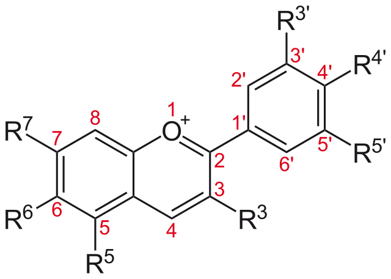
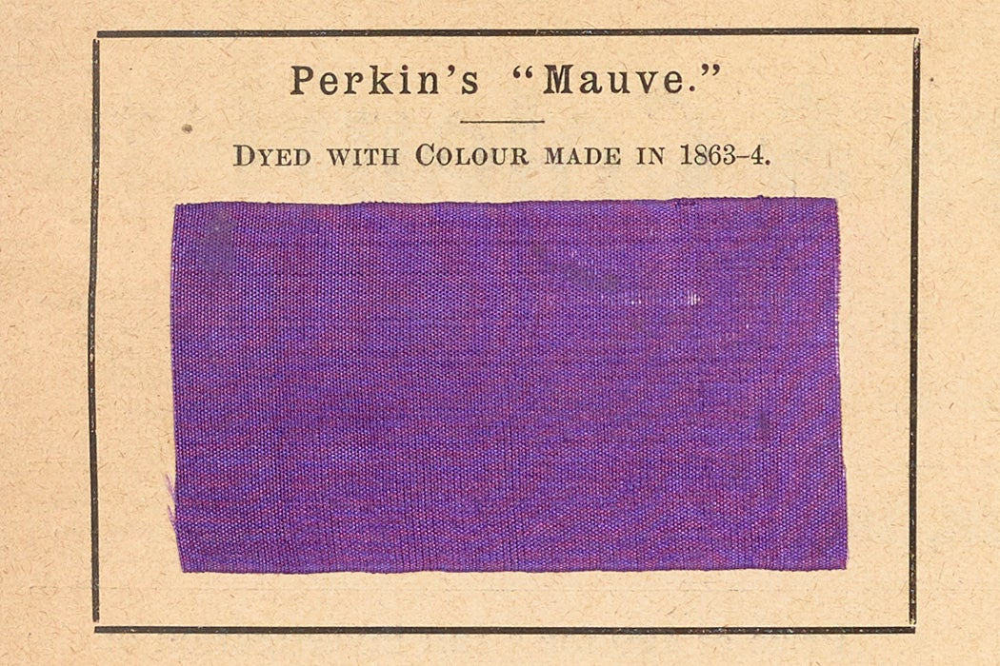
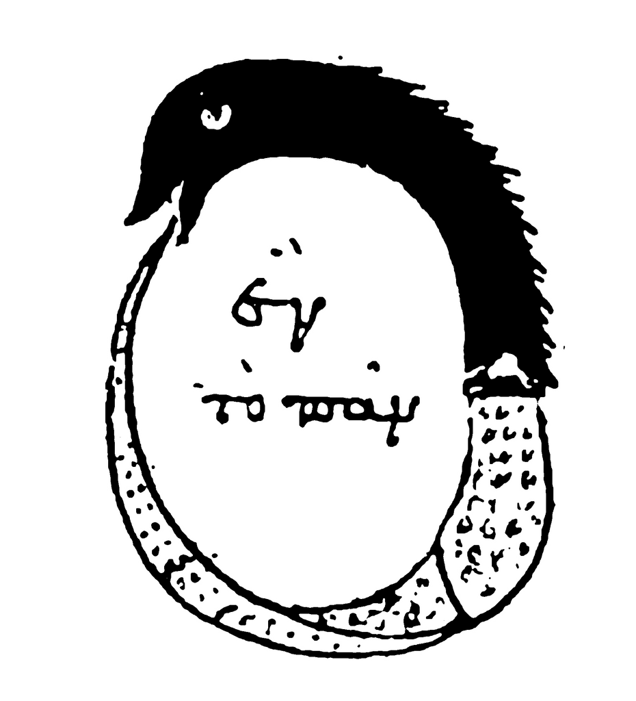
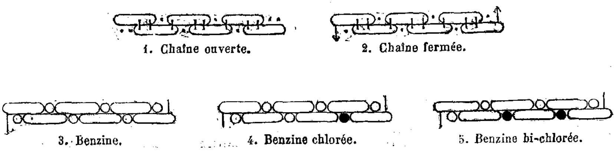
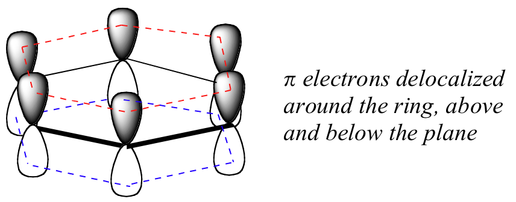
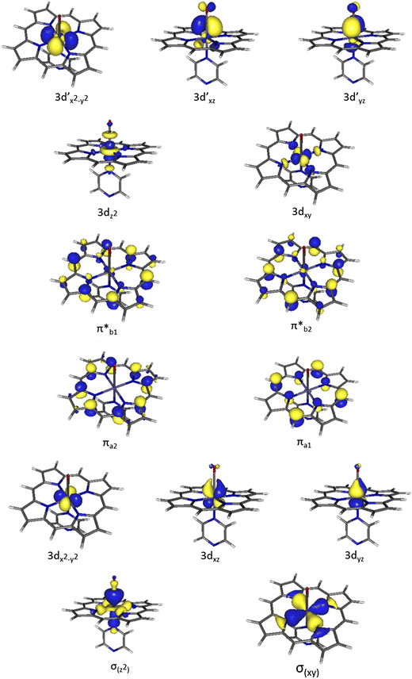
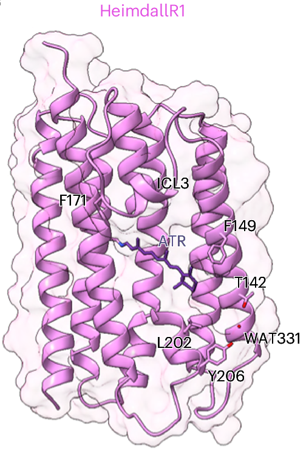

### Pauvre mauve 🪻

There's an abundance of green in the natural world (because plants harness the abundant red light from our sun), but blues and purples stick out because they are so [rare in nature](https://set.adelaide.edu.au/news/list/2019/08/20/why-is-the-colour-blue-so-rare-in-nature). Maybe that's why blue is [humanity's favourite colour](https://au.yougov.com/international/articles/12336-why-blue-worlds-favorite-color-1). Bird and butterfly wings have to restort to optical trickery (metamaterials), blueberries get their name and antioxidant health craze because their skin packed with the crop pigment [anthocynanin](https://en.wikipediea.org/wiki/Anthocyanin), and the blue skin of the poison dart frog is from the very same chemical (pumiliotoxin) that makes it poisonous.

Almost all colours in the blue end of the spectrum (as well as many others) come from an anthocyanin pigment, which are built from the anthocyanidin skeleton shown above.  —**Wikimedia Commons**, [NEUROtiker, 5 August 2008](https://commons.wikimedia.org/wiki/File:Anthocyanidine.svg). 
{:.figcaption}

Similarly, there's an almost complete abscence of natural purple. Purple cabbage and eggplant contain the same anthocyanins as blueberries, and while violet flowers are so striking the colour is named after them, they do not make a colourfast dye that will last in fabric. So, when nature was our only source of chemicals, people's desire the harness the spectrum of 'cool' colours came from crushing the leaves of the somewhat drab woad and the perennially popular indigo (which is both a type of plant and one of Newton's seven 'ROYGB**I**V' colours). 

The only concentrated, colourfast sources of organic purple come from the seas. *Aplysia* sea slugs [spray purple](https://youtu.be/qmn1bpz00qA?si=ajvqjlsCp7IaI25-) aplysioviolin molecules when threatened, which they have built up from eating red algea, stripping the colour molecule from the algae's light harvestting proteins, and concentrating a modified molecule in their ink glands. A painstaking, but more relaible, way to harvest natural purple is to extract ink glands from the *Murex* sea snail. The 'Tyrian purple' dye harvested from these snail glands was, and is, [outrageously expensive](https://youtu.be/IVXqisH6VeM?si=mRh5GDGBscIPJDDH), fetching around $3000 USD/g in the 21st century. Tyrian purple is in fact a bromoniated derivative of indigo, synthesised using a bromoperoxidase enzyme unique to *Murex*. Scientists still have not confirmed the active metal within the *Murex*'s bromoperoxidase enzyme (most bromoperoxidases use the rare Vanadium), or which sea snail gene encodes for it. 

### Lapis lazuli and other blues of value 🔵

Even the colour diversity found within the minerals of the Earth was of little help; the naturally occuring pigments minerals are prone to dull hues, quick fading, and discolouration into green (*e.g.* azurite). Pure, brilliant blue mineral pigment was only provided by eye wateringly expensive lapis lazuli (Ultarmarine), mined only in mountains on the North-Eastern tip of Afghanistan. Ultramarine would cost up to 100x other pigments, but its dazzling effect was used in relgious iconography across Asia and Europe and is a notable in famous paintings (*e.g.* the [blue headscarf](https://heritagesciencejournal.springeropen.com/articles/10.1186/s40494-020-00364-5) in *"Girl with a Pearl Earring"*). Synthetic mineral blue dyes were also created in ancient times from copper Silicates (mixed with `Ca` - "Egyptian" Blue, or `Ba` - "Han" Blue & Purple), or otherwise just from indigo 'baked into' a mineral substrate, as detailed in a in *Chemical Society Reviews* on ["The invention of blue and purple pigments in ancient times"](https://doi.org/10.1039/B606268G). Han Purple is not a pure purple, but is due to red-copper oxide impurities in production. All these synthetics, however, paled in comparison to "true" Ultramarine and lapis lazuli was in demand well into the 19th century. The physical origin of the intense blue appearance of Ultramarine is chemically interesting: rather than a light absorbing metal at the centre of the mineral, there is instead a caged negatively charged trisulfur radical (S$$_3^{.-}$$).   

Now with modern chemistry, blue hues can be made that are so striking that an artist can make a multimillionair dollar name for themselves with [one famous blue dye](https://www.invaluable.com/blog/yves-klein-blue/), and scientific careers and reputations can be built upon chemists' prowess to manufacture the [bluest blue](https://www.huffpost.com/entry/quantum-blue-berkeley_n_5b8db0a4e4b0511db3db33a1). The chemistry of commercially abundant purple dyes, however, was only cracked in the 19th, and now still purple and violet contain unplumbed depths in colour terminology, our [visual perception](https://jakubmarian.com/difference-between-violet-and-purple/) near the UV wavelengths, and even the [colour range](https://ericportis.com/posts/2024/okay-color-spaces/) of our computer monitors. 
 

### Porphyrogeniture 👑

Purple has long signified royalty and power, to the point that its use was restricted to high office. This wasn't just due to the expense of natural purple dye, but was often enforced by social codes and law. Famously, Romans officials would line their formal attire (togas) with a strip of purple lining the border. This style, the *toga praetexta* (from Preator, a magistrate position below Consul) wasn't restricted to appointed official, but likely had a religious origin and was worn by priests and [pre-adolescent children of fortunate birth](https://www.jstor.org/stable/693055i). However, a toga fully clad in pruple was restricted to Roman conuls and generals performing a Triumph, and later to the Emperor alone, and the unsanctioned wearing of purple was even codified as an offence punishable by death during Nero's reign. The association of the Tyrian purple hue with royalty extended beyond clothing, and Byzantine (Eastern Roman) queens would give birth to future rulers in rooms decorated with a deep-purple Imperal Porphyry (from Ancient Greek *porphyra* - lit. purple) stone. This colour distinction of the birthright to rule was enforced from cradle to grave, as Emperors were buried in tombs made from porhyry, some [survive today outside the Archealogical Museum in Instanbul](https://www.pallasweb.com/deesis/imperial-porphyry-tombs.html). 

### Born in the purple 🟣

Ironically, despite the incredibly rarity of steadfast purple in nature, purple was the first in a tidal wave of synthetic industrial dyes, bringing the colour to the masses causing it to become commonplace and unfashionable in quickly after reaching the mass market. The discovery of artifical purple dye (mauvine) was entirely accidentally, but the chemical knowledge to synthesise at massive scale required the unravelling some of the fundemental mysteries in organic (carbon-based) chemistry, and clarification how electrons create molecular structure and govern the interactions of dye molecules with light.  

### Muckracking ⚗️

- The search for a cheap route to quinine to treat malaria 

Perkin's mauve was a runaway success, until it became so fashionable to be tawdry and the use of the gaudy colour fell out of fashion for everyday wear. 
 — *Journal of the Society of Dyers and Colourists*, **Nov 1906**, *via* the [Science History Insitute](https://digital.sciencehistory.org/works/o2sfuyr) . 
{:.figcaption}

William Henry Perkin discovered artifical purple dye entirely by accident. His motivation was not encolouration, but Empire.
- Perkin and the dye industry
[Perkin and Hofmann](https://pubs.rsc.org/en/content/articlelanding/1896/ct/ct8966900596)
- The search for cheap feedstocks

### Benzene: The daydream snake 🐍♻️♾️ 

Benzene is a molecule. It has a storied history of it's organic structure being tough to figure out, but when it was the concept unlocked whole new fields of synthesis.  

- It took 40 years from the experimental isolation of benzene in a lab to solve its chemical structure. Remeber structural proposals were well before the discovery of the electron (Begat six aromatic electrons paper)  
- Kekulé's daydream of a serpent eatin it's own tale [GET A PUBLIC PAGE OR A PUBLICATION]  

The ouroboros has a long history, including a connection to alchemy where it is illustrated here in relation to *chrysopoeia* ("gold-making") through balancing "one in the everything". —*"Chrysopoeia of Cleopatra the Alchemist"*, pseudonym, 3rd or 4thC A.D 
{:.figcaption}

Kekulé's serpentine solution of benzene's structure is actually used within the book Gravity's Rainbow as a metaphor the economic boon that destructive cycle of WWII war economy brings:
> “Kekulé dreams the Great Serpent holding its own tail in its mouth, the dreaming Serpent which surrounds the World. But the meanness, the cynicism with which this dream is to be used. The Serpent that announces, “The World is a closed thing, cyclical, resonant, eternally-returning,” is to be delivered into a system whose only aim is to violate the Cycle. Taking and not giving back, demanding that “productivity” and “earnings” keep on increasing with time, the System removing from the rest of the World these vast quantities of energy to keep its own tiny desperate fraction showing a profit: and not only most of humanity—most of the World, animal, vegetable, and mineral, is laid waste in the process... No return, no salvation, no Cycle—that’s not what They, nor Their brilliant employee Kekulé, have taken the Serpent to mean. No: what the Serpent means is—how’s this—that the six carbon atoms of benzene are in fact curled around into a closed ring, just like that snake with its tail in its mouth, GET IT?"

-*Gravity's Rainbow*, Thomas Pynchon, pg. 412, Penguin 2nd Ed.
 

- In the [*"Coloring Gravity's Rainbow"*](https://doi.org/10.16995/pn.374) the author's apply criticl lens to the chromatic and chemical connections in this book. The protagonist's very name -- Tryone -- has be interpreted to be linked with Tyrian purple, and his essence with sliding colour scales, and his subjection to the totalisating nature of nomenclature and technology linked to the naming schemes of the colour industry. 

%footnote 5 in "Colouring Gracity's Rainbow", 

"Who makes dyes today can tomorrow make high-explosives" 
{:.note title="Dyes and disarmament"}
-[*World Disarmament and the Master Key Industry*](https://books.google.com.au/books/about/World_Disarmament_and_the_Master_Key_Ind.html?id=CXIPZy6UnVUC&redir_esc=y), America dyes institute,**1921**. 

### The controversial birth of "Aromaticity" ⌬ ↔ ⏣

Kekulé's schematic of benzene illustrates a sense of overlap, but doesn't accord with current ways of representing organic molecules. —["Sur la constitution des substances aromatiques"](https://lib.ugent.be/catalog/rug01:001282677), Kekulé M., *Bulletin mensuel de la Société Chimique de Paris*, pg. 98-111, **1865**.
{:.figcaption} 

- Aromaticity (a terrible misnomer, as with most chemical nomenclature, from a generalisation of the observation that benzene and toluene smell sweet). 
- Add some history of why it was called aromaticity (scientist names). Talk about how aromatic 'sections' of molecules give them some of their most interesting chemical behaviour
- Resonance  -- a terrible misnomer, as with most chemical nomenclature, because molecular nuclei do *not* 'resonate' between two separate resonance structures ([as many of the original theorists well knew, though confusion rose rapidly due partly to sloppy exposition by Pauling in a campaign to expand the conceptual basis of structural chemistry.](https://www.jstor.org/stable/4027968)).  [misunderstanding of Kekule claiming "vibrating" he literally meant internal vibrational temporary distortions of a D6h symmetric ring, not oscillating between "resonance contributors" 
- Figure of benzene "resonance contributors" and the true delocalised dashed line ring version 
- The Soviet opposition to resonance. The term mesomerism occasionally making an appearance instead.  
A vocal minority of Soviet scientists [viewed the resonance concept as fictitious mathematical idealisation that was antithetical to dialectal materialism](https://www.jstor.org/stable/227752), so the state adopted a terminological slight of hand to avoid referring to resonance or using 'resonance structures' as a teaching aid.  
- Armit and Robison "aromatic sextet" [paper](https://doi.org/10.1039/CT9252701604)
- Don't let the historical account get in the way of a good story. *Chemical Reviews* provides a good instructional [review paper on this history](https://doi.org/10.1021/cr0300946). Nevertheless, a sizeable chunk of Kekules students went on the work in the german Dye industry 

... this segues back in William Perkin knowing enough about aromatic chemistry to search for quinine precusors.  [Actually, Kekule's benzene is in 1865 and Perkin discovers aniline purple in 1856.. so but Kekule after Perkin and leading into the German industrial behemothss
 

 - [Collections of early napthalene dye experiments](https://armstrongwynne.org/). Despite the research being pioneered in England, Germany would develop the dominant chemical dye industry. 

### Coal tarred and feathered 🪨

- BASF - *Badische Anilin und Sodafabrik* (Baden Aniline and Sodium Carbonate Factory). The rise of this company was meteoric after [Haber and Bosch invented their method]() to turn nitrogen from the air into fertiliser. The sodafabrik part of BASF is infamous of New South Wales highschool students who had to memorise the conditions of the Solvay process as part of their Industrial Chemistry module.
- Known as the [Aniline women](https://www.basf.com/global/images/about-us/history/21252221_BRO_Anilinerinnen_englisch_final.pdf.assetdownload.pdf)
- BASF would go on to join I.G. Farben (very literally, "The Colour Syndicate"), a cartel appearing as a constant ominous industrial spectre stalking Gravity's Rainbow, tragically mirroring how these scientifically and commercially pioneering chemical companies were wrested into the control of depraved, horrific warmongers; the 'Them' of the military-industrial complex which haunts the book's entire narrative.
- The societal implications
- Medicine 

### The electronics of dyes 🎨

Chemical aromaticity arises due to a planar cyclic p-orbital system that can delocalise to form a π-electron system around a closed ring. —**LibreTexts Chemistry** [*15.9: "What Is the Basis of Hückel’s Rule?"*](https://chem.libretexts.org/Bookshelves/Organic_Chemistry/Map%3A_Organic_Chemistry_%28Smith%29/15%3A_Benzene_and_Aromatic_Compounds/15.09%3A_What_Is_the_Basis_of_Huckels_Rule), Tim Soderberg (University of Minnestota, Morris)
{:.figcaption}

Hückel's rule for aromaticity: any cyclic arrangement of $$ 4n+2 $$ carbon atoms, where electrons are "shared" between all atoms in the ring, $$ n=1,2,3... $$  
{:.note title="Hückel's rule"}

- In fact the overlapping ring can be an unusual configuration, leading to things like [Möbius armoaticity](https://commons.wikimedia.org/wiki/File:Mobius_v_huckel_aromatic.png)

- Some more of  [Seth Olsen](https://condensedconcepts.blogspot.com/2018/02/seth-olsen-1975-2018-theoretical-chemist.html)'s papers? amongst others
	- Dyes are still a testbed for the theoretical chemistry of colour. Like revisiting the [classic green and red dyes](https://pubs.acs.org/doi/abs/10.1021/jp309006e)
	- Some very interesting work on how dyes reveal the chemical relationships that determine the nature of electronic transitions. [A Modified Resonance-Theoretic Framework for Structure−Property Relationships in a Halochromic Oxonol Dye]() -Seth Olsen, *Journal of Chemical Theory and Computation* **2010**, *6*, 4, 1089-1103. 
The absorbance wavelength of an asymmetric dye is no redder than the mean wavelength of its symmetric parents and deviates from this by a blue shift which increases as the difference in basicity of the terminal groups.
{:.note title="Brooker's Deviation Rule"}
-["Absorption and resonance in dyes"](https://doi.org/10.1103/RevModPhys.14.275), *Reviews of Modern Physics*, **14**, 275, **(1942)**
 

- % Prohpyrin means 'purple' and is the central unit in chlorophyll, heamoglobin, some luciferins in bioluminenscence (link out) 
- % Azulene from azure 'blue' and the -ene suffix of double bonds. 

- % Porphyrins (lit. purple) and electronic excitations should go here??

- % [Research in 2023](https://doi.org/10.1021/jacs.3c07625) proposes why azulene's light emission is special from the excited state: it has a unique anti-aromatic properties that means it disobeys a long standing principle in photochemistry -- that photon emission is from the lowest electronic state of a give electron spin state. It also displays beautiful examples of (anti)aromatic ring currents.  %This paper has a really good illustration of pi-aromaticity, whether it forms multiple small rigns, or one large ring around the perimeter

-Porphyrins also cause electrons to behave in very interesting ways...

Ten active oribtals in the electronic structure of iron-porphyrin complex typical of [haem proteins](https://www.nobelprize.org/prizes/chemistry/1962/perspectives/). Calculated at the CAS(14e,14o) level of theory with $$ A_1 $$ symmetry. —["Methodological CASPT2 study of the valence excited states of an iron-porphyrin complex"](https://doi.org/10.1007/s00894-017-3226-y), *Journal of Molecular Modelling*, vol. 23, *53*, **(2017)**
{:.figcaption}

#### TODO: add bioluminesence post interal link 
- Use of porphyrin and porphyrin derivatives in other organisms:
	- cholorphyll - [link to the WEHI's gobsmacking animation of the photosynthesis process](https://youtu.be/jlO8NiPbgrk?si=qAVHE1R_WHU4dvS1) that shows the quantum process of closely held chlorophyll pairs converting light into electron flow by splitting the surrounding water into oxygen.
 	- In another instance of photobiology, porphyrins are found in Sierra luminous millipedes (*Motyxia*) where the 'glow-in-the-dark' [appearence of the millipede](https://en.wikipedia.org/wiki/Motyxia#/media/File:Motyxia_sequoiae_(Loomis_&_Davenport,_1951).jpg) is known to come from a [photoprotein containing a porphyrin](https://www.sciencedirect.com/science/article/pii/0305049184903675?via%3Dihub) but whose structure is unresolved (and maybe should be re-investigated now that previous homology models have been drastically improved upon in the AlphaFold age). 
	- billins e.g. phycobilin (algea) where they are used by non-animal organism for [interesting light harvestin properties.](https://www.nature.com/articles/nature08811), including making light-harvest 'antennae' stacks of phycobilisomes.
	- the pigment that makes [egg shells brown](https://www.compoundchem.com/2016/03/26/eggs/) (or blue-y green when if broken down to oocyanin)
	- haem (as in haemoglobin) famously striking colour of bright red oxygenated blood, which is broken down within 3-4 months by yyour liver to produce not a purple pigment, but first the disconcerting green and amber pigments of bile, then the [light yellow of urine](https://www.compoundchem.com/2017/01/12/bodily-fluids/). Unless you are unluckly enough to be suffering from [porphyria disease](https://en.wikipedia.org/wiki/Porphyria) where haem is badly formed and your urine does indeed turn purple.
	- the fur of mammals have also been known to glow under UV [due to accumulation of porphyrin as a disposal mechanism](https://www.museumfuernaturkunde.berlin/en/museum/media/press/fur-glowing-under-uv-a-common-feature-mammals).
	- geoporphyrins from crude oil and shale, which were are [chemical indicators petroleum presence](https://pubs.acs.org/doi/10.1021/acs.energyfuels.1c02002), and one of the [first clues that petrol has biological origin](https://doi.org/10.1016/j.orggeochem.2005.09.001)
	- the vitamin B12 [core framework socket where cobalt sits](https://en.wikipedia.org/wiki/Vitamin_B12#/media/File:Cobalamin_skeletal.svg).

### Retinal, in our eye 👁️ and in microbes 🦠 
 - % Bacteriorhodopsin, occurs in the "purple membrane" which is 60 % protein by weight, and perhaps intimately linked with vision itself as the origin origin of molecular basis of light detection since the retinal that has been used to pump protons is also what drives occular vision. The strucutre of bacteriorhodopsin was [solved to decent resolution using cryo-EM](https://doi.org/10.1016/S0022-2836(05)80271-2) by Richard Henderson and co-workers, who would later go on to win a [Nobel prize](https://www.nobelprize.org/prizes/chemistry/2017/popular-information) in part due to that work. 
- The bacteriorhodopsin proton pumping process is illustrated in [this video](https://youtu.be/w241TNxqa6I?si=CXurpxOgOoDX-key) showing how retinal's absorption of a photon triggers an isomeration concurrent with a protein shape change and exited-state proton transfer.  
- Found in all sorts of light harvesting organisms, including the Asgard archaea 

Structures of HeimdallR1 rhodopsin with the retinal chromophore, energy minimised using a QM/MM method. —["Structural insights into light harvesting by antenna-containing rhodopsins in marine Asgard archaea"](https://doi.org/10.1038/s41564-025-02016-5), *Nature Microbiology*, **10**, 1484–1500 (2025).
{:.figcaption} 

Which brings us full circle. Purple gave nature rhodopsin, allowing bacteria to feed off light. Rhodopsin now mediates our dim light vision (most sensitive to blues), while our cones allow us to gaze on purple in all its power and write a post of purple prose about it. 

---

Purple is my favourite colour :) 
{:.lead}

*[Deep Purple](https://deeppurple.com/) is shrouded in mystique, while there's something spectral about [High Violet](https://4ad.com/releases/922) hinting at energies just beyond human perception.* 
