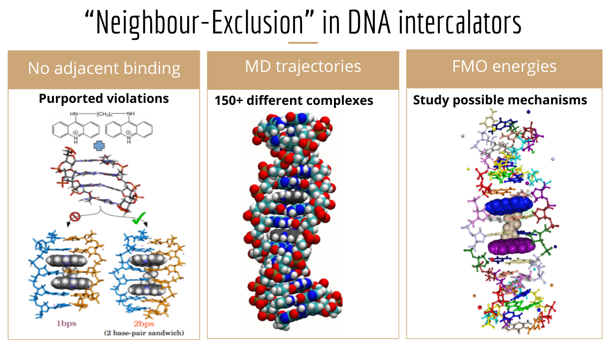

# Projects

<!---
Add an APAF section here about refactoring code base with the PhD student into APAFunctions. Coordinating with BioCommons to get APAF code on proteomics.usegalaxy.org.au
-->

## Structure-Activity Relationships for Carbonyl Photolysis -- (PhD)

The photochemistry of diverse small carbonyls could be used to predict the behaviour of atmospherically important molecules.
{:.figcaption}

My [PhD thesis](http://handle.unsw.edu.au/1959.4/65036) was on the development of a set of rules that define the relationships between the molecular structure of a carbonyl and how it reacts following UV light absorption. Carbonyls are central to the atmosphere, they are one of the few atmospheric molecules that absorb UV, the radicals they create from UV photolysis drive chemical cycles, and the C=O functional group is formed abundantly when carbon-containing molecules oxidise in the atmosphere. Atmospheric chemistry models manage the simulation of thousands of
atmospheric molecules by using structure-activity relationships (SARs), but no SARs had been developed for carbonyl photolysis. Instead, cruder "surrogate" approximations are employed based upon experimental data for roughly a dozen molecules. 

My PhD thesis developed SARs from comprehensive reaction threshold calculations on 38 representative carbonyls, across all relevant electronic states. [My thesis](http://handle.unsw.edu.au/1959.4/65036) is an attempt to derive more general carbonyl photolysis SARs to cover a wider range of molecules and reaction types. The dominant Norrish Type I photolysis reaction is covered in a [paper in JPCA](https://pubs.acs.org/doi/10.1021/acs.jpca.9b05534), and energetically accessible photo-initiated ground state reactions are covered in a [paper in ACP](https://doi.org/10.5194/acp-22-929-2022).  Preprints on the topics of other reactions and protocols are available [on ChemRxiv](https://chemrxiv.org/engage/chemrxiv/search-dashboard?authors=Keiran%20Rowell)

## Revising Neighbour-Exclusion in DNA Intercalators -- (Honours)

My simulations revise previous literature by indicating diacridines can insert into DNA without violating neighbour-exclusion. 
{:.figcaption}

I studied the insertion of diacridines (linked, flat aromatic molecules) into DNA for [my Honours work]({{ site.baseurl }}/Rowell_Honours.pdf){:.no-push-state}, from which I received the top mark in Angyal Prize (Best performance in Honours Chemistry). I used molecular dynamics to study the structural feasibility of various binding modes, analysing the insertion into over hundred different structures, where the A,T,C,G sequence at the binding site, the diacridine linker chain length, and bound DNA groove were varied. These dynamics trajectories showed that insertion of both acridine ends was viable and in agreement with empirical measurements. I also performed fragment-based quantum chemical and free energy calculations to attempt to determine the basis of the neighbour-exclusion principle, *i.e.* insertion cannot occur at adjacent base-pairs, whose physical origins are still unclear. This work is detailed in a [paper in Biopolymers](https://onlinelibrary.wiley.com/doi/10.1002/bip.23409).
